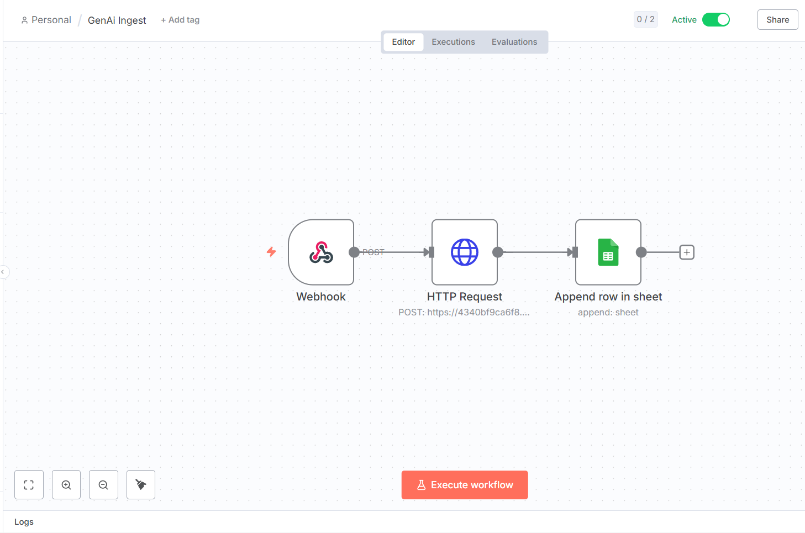
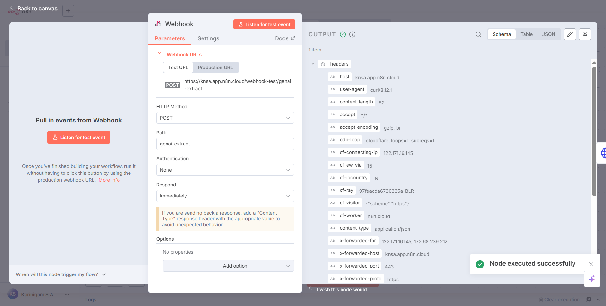
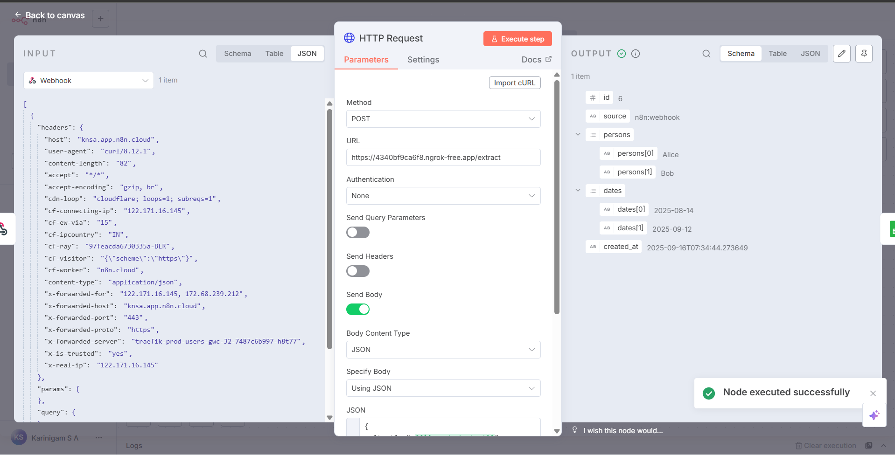
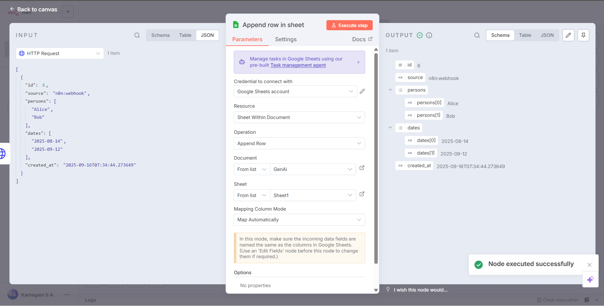
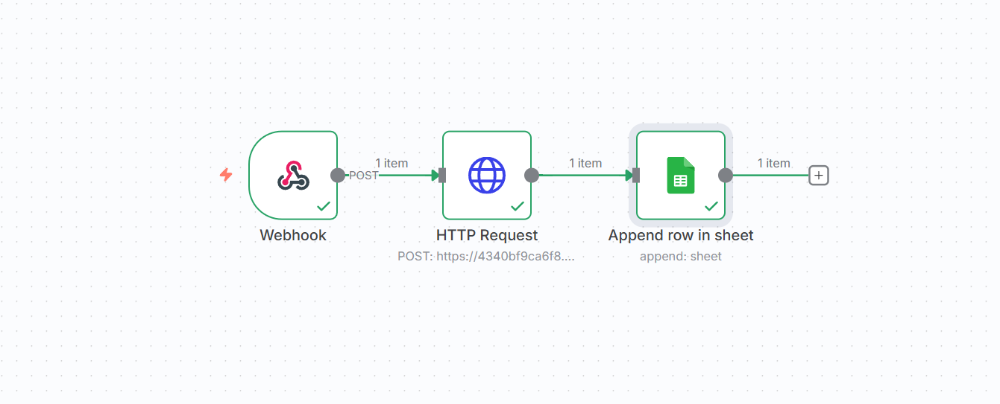
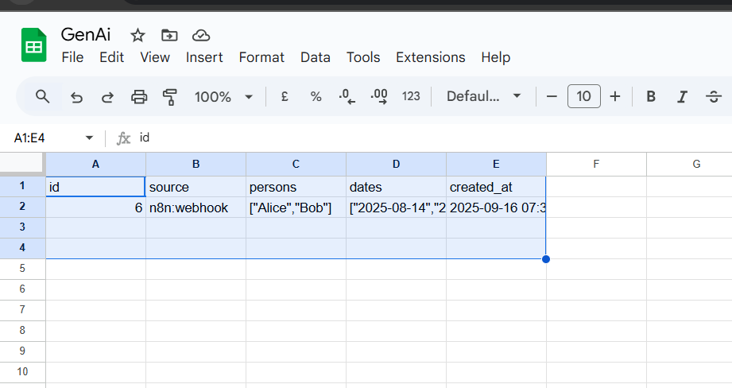

# Gen-AI Text → Entities (FastAPI + n8n + SQLite)

## Run
python -m venv .venv
.venv\Scripts\Activate
pip install -r requirements.txt
python -m spacy download en_core_web_sm
uvicorn app.main:app --reload --port 8000

## Endpoints
POST /extract        # {"text": "...", "source": "api:text"}
POST /extract-file   # multipart file=.txt
GET  /records
GET  /healthz

## n8n
Webhook (POST /genai-extract)
→ HTTP Request (POST https://<ngrok>/extract, body: {"text": {{$json.body.text}}, "source":"n8n:webhook"})
→ Google Sheets (Append: source, persons(JSON), dates(JSON), created_at)

## Examples
- examples/input/sample1.txt
- examples/output/sample1.json (captured from API response)
- n8n/workflow.json
 
## n8n Workflow Integration

This project integrates with **n8n** to automate the pipeline:
1. **Webhook Node** → receives text input.
2. **HTTP Request Node** → sends text to our FastAPI `/extract` endpoint.
3. **Google Sheets Node** → appends extracted data into a sheet.

### Workflow Export
The full workflow is available in [XorGenAi.json](XorGenAi.json).  
You can import it into n8n directly.

### Screenshots

#### Workflow Overview

#### Execution Example

#### Google Sheets Output

